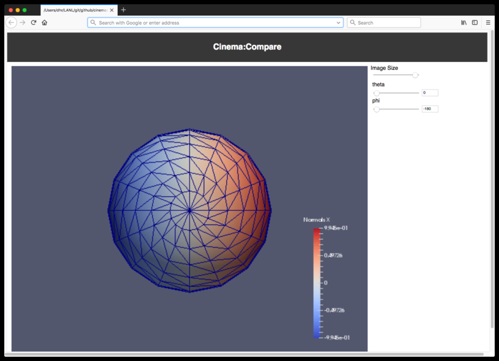
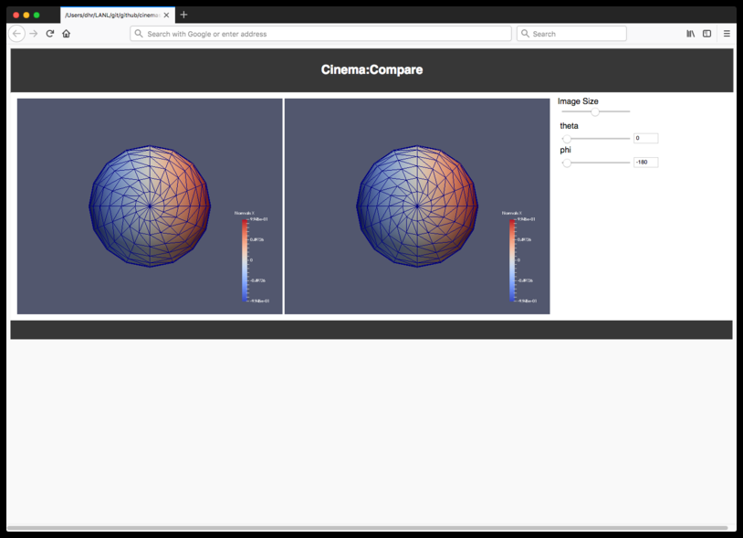

## Test plan for Cinema Compare 1.0

To test this release:

- Make sure `Firefox` is installed. If necessary, edit the script `doc/testing/1.0/create_testcases` to correctly call `Firefox`.
- cd to the main repository directory
- run `./doc/testing/1.0/create_testcases`
- The script creates two files: `test_single.html` and `test_double.html`, then opens `Firefox` on those files. The files are then deleted after a short pause. The two browsers should look like the two below.

<table>
<tr>
<td width="50%"></td>
<td width="50%"></td>
</tr>
<tr>
<td>Screen capture of the viewer with a single database.</td>
<td>Screen capture of the viewer with a double database.</td>
</tr>
<table>

- If the browsers look similar to the above, perform the following manipulation tests:
    - sliding the `Image Size` slider will make the image larger and smaller.
    - sliding the `phi` slider will appear to rotate the sphere. There is only one value for the `theta` slider, so it is not manipulable.

If the above operations work, then the test is successful.

