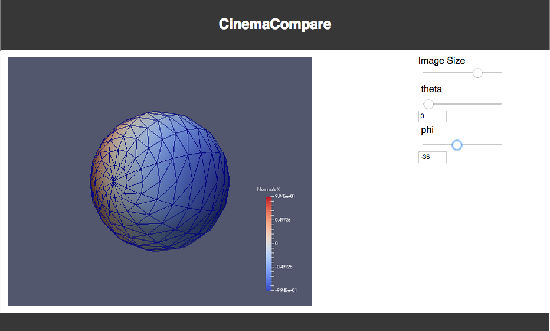
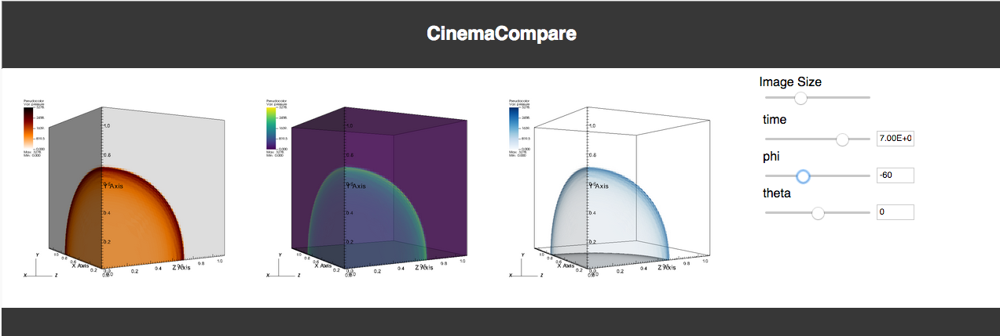

## Cinema:Compare repository, Release v1.0

A simple viewer that compares several Cinema Spec D databases. It can also be used to view a single database, and is easily customizable to include other elements through direct editing of the `html` or `json`.

## Using the viewer

To use the viewer, edit the `index.html` file, and change the value of the array named `dataSets` to include the path to your Cinema Spec D database.  Uncomment the appropriate line to choose to view the single example database (a sphere) or the multiple example databases (a Sedov blast wave).  


```
// START: Array of databases to view
// Single example Cinema database -- comment out for multiple example test
 var dataSets = [  "data/sphere.cdb"];

// Multiple example Cinema databases -- comment out for single example test
// var dataSets = [  "data/sedov1.cdb" , "data/sedov2.cdb" , "data/sedov3.cdb"];
// END : Array of databases to view

```   			

Then, view the `index.html` file in the Firefox browser.  The single database will show the example sphere, with one slider present for every column in the Cinema databse:



The multiple database comparison has the same data rendered in different colormaps and opacity settings.  Setting phi=-60 and theta=0, you can see the blast wave develop as you increase time:



## Contact

Contact `cinema-info@lanl.gov` for more information.
